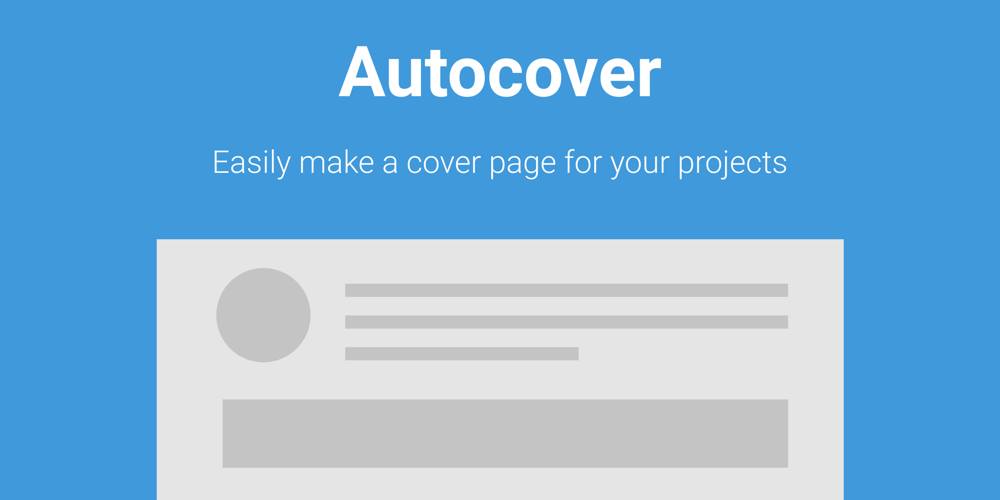

# Compliments

Select a FRAME from your design to easily make a "Cover" page for your design files.  Figma will then show this cover image in your project view instead of a zoomed out view of the first page of your design document.

## Figma Documentation
Please see [Figma's Making Plugins](https://help.figma.com/article/331-making-plugins), their [Plugin Documentation](https://www.figma.com/plugin-docs/intro/), and view their [sample plugins](https://github.com/figma/plugin-samples) to get started learning about plugins today.

## Code Overview
The two main files are ***code.ts*** and ***ui.html***.  Figma **strongly** suggests that you use TypeScript when building plugins.  Also, they recommend breaking up large plugins into multiple files and using Webpack in order to create your resulting file you'll submit for your plugin.  For this plugin, I simply kept all of the code in one file.  Lastly, I brought in jQuery rather than use vanilla js.

## Key points to help you get started
- Resources such as js / images / etc have to be remotely hosted **if you do not use Webpack**. (I hosted mine in an Azure blob storage).  I will probably switch to Webpack in the next version so the plugin will be faster.
- The dimensions for the frame of your plugin are set as options in *code.ts* in the **figma.showUI(...)** line.  When creating a new empty plugin, Figma leaves this out.
- If using jQuery (or similar) all document.ready / $(function(){... code runs correctly because your plugin is shown in an iFrame.
- This is stated all throughout Figma's docs but I will repeat it here.  Your plugin code and html/iframe code are sandboxed but can message back and forth.  Thus, your *code.ts* file can ONLY access the figma design document and your *ui.html* can ONLY access you plugin's UI.
- Lastly, the Figma team was ***VERY*** helpful when reviewing this plugin.  The review only took 2 days (though they say it can take anywhere from 2-5 days).  They not only accepted the plugin but gave me some feedback, constructive criticism, and encouragement.

# Have fun
### If this helps you then drop me a line: [AndrewGene](https://twitter.com/AndrewGene)
